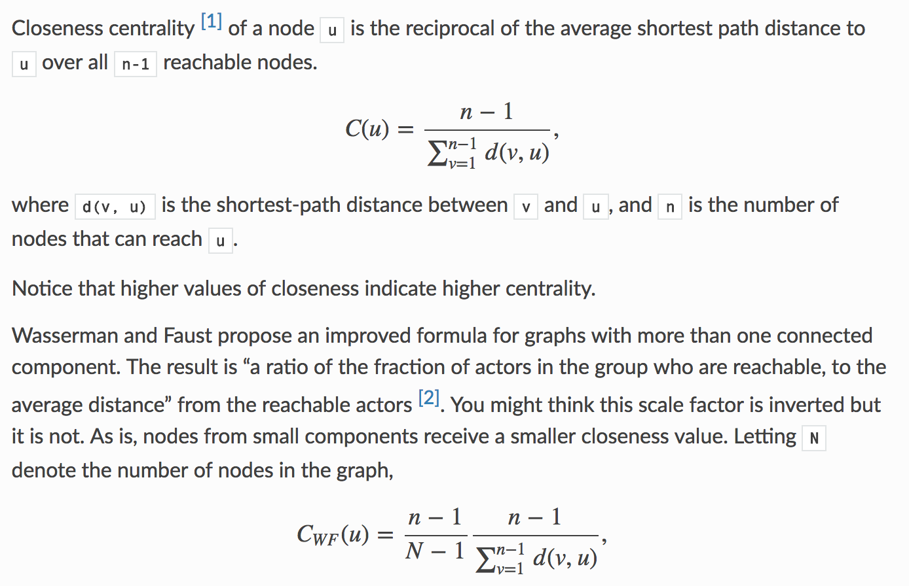

### !0 **Should the return value of outIncident() and inIncident() be a copy of the AdjList stored in the graph, or a direct pointer to the list in the graph representation?**

Both have their advantages and disadvantages but because our program will be calling this function once every single node in a graph multiple times, going with the faster option would be a good idea.
Obviously this would be to return a direct pointer. Since no function ever needs to edit the graph, only read from it, this would work fine.

On the same vain think about how you could optimise inIncident.

> gotta go fast !- Sanic

### !1 **Can Edge weights be 0 or less?**

!! We will never give you a graph with edge weights of 0 or less.

### !2 **How do i modify Dijkstra to keep track of multiple paths!**

! somebody didn't go to lectures lmao

Look at the lecture where ashesh went through how to do a dijkstra with a pred array of linked lists. But the basic concept is you can keep track of multiple preds if you carefully think about the cases when you want to add to the list.

### !queue **How do i build a linked list for my PQ without editing PQ.h?**

Implementation specific details of priority queue (PQRep) should not be in PQ.h, it should be in PQ.c. For example, if one implements PQRep using an array, we do not need any pointers!; for a linked list we need prev/next; and for say a tree as per tree ADT. So in PQ.c, depending on the implementation we define PQRep.

You can build a linked list which stores ItemPQ and manipulate that within PQ.c

! As long as you can return the right ItemPQ you can store it in whatever data structure you want

### !3 **I started this assignment way too late! Help!**

!! We have no mercy

Ok but if you are starting this super late, it's a pretty linear assignment. Start by building up the graph representation, then the PQ and then the search to start getting some of the basic marks.

Then progress to the easier centrality measures such as degree and then closeness.

After that if you have time you can tackle the harder final bits of the assignment.

As you are going through, test often! write your own tests! you want to make sure you get as many marks as you could have gotten for the previous section before moving on so you can submit at the last minute having the most correct code you can. Trust me, do not leave debugging to the last minute, write a bit of code, test it, fix it. Use the test files to write direct function tests in the main function.

### !4 **What if in the closeness calculation we find isolated nodes?**

The closeness of a node that is connected to no other nodes is 0

As for how to calculate the closeness of all other nodes you can just ignore any node you can't reach for the calculation but then scale your value depending on how many nodes you _can_ reach.

See the snippet below from someone smarter then me

</a>

### !5 **Are any of the test cases interesting?**

Actually test input 6 is a graph of the relationships between characters in the play Les miserables.

http://visjs.org/examples/network/exampleApplications/lesMiserables.html

I wanted to put in labels so you could see names but that would mean making the graph adt more complicated and thought i'd spare you the pain.

### !6 **How do i use the testing interface**

If you just run ./testCentralityMeasure you will get a help message on how to use the test interface.

For example with testCentralityMeasure you get

```
Usage: ./testCentralityMeasures <file> <flag>
Valid Flags:
    d    : degree centrality
    do   : degree out centrality
    di   : degree in centrality
    c    : closeness centrality
    b    : betweenness centrality
    bn   : betweenness centrality normalised
    v<m> : View graph with mode <m>
Valid Modes:
    0    : DEFAULT
    1    : DEGREE_IN
    2    : DEGREE_OUT
    3    : DEGREE
    4    : CLOSENESS
    5    : BETWEENNESS
```

So if you wanted to see the output for your degree_in function for the 2nd test graph you would run
`./testCentralityMeasures graphs/2.in di`

! Note that the modes are how the graphVis interface will colour nodes, with default all nodes will be the same shade of red whereas if you use the flag `v3` the nodes colour will be brighter if it has a higher degree centrality and more grey if it has a lower centrality.

### !7 **How do i use the graphVis interface**

Whenever you want to draw up the graph just call the function "graphVis" as such

`graphVis(g, DEFAULT);`

You can change the mode to be any of the below to change how the system colors nodes. If you choose Degree for example, nodes with higher degree centralities will be coloured more red.

```
DEFAULT
DEGREE_IN
DEGREE_OUT
DEGREE
CLOSENESS
BETWEENNESS
```
Once the function is called a link is printed to the terminal, paste that into a web browser (chrome works best) to see the graph and play around with it.

!! Note that everytime you call the function the previous draw is overriden so if you want to draw the graph multiple times in 1 run you have to use GDB and set breakpoints after each draw so you can see the graph before overriding it


### !10 **What on earth is this math, i'm not a math person**

> Math, more like no !- Zain

Yeah that's fair, it was confusing to me too, so lets break down each centrality.

**Degree**

This is just a sum of the number of edges connected to a certain node. If a node has 3 outgoing edges and 1 ingoing edge it has a in degree of 1, a out degree of 3 and a degree of 4 (degree is a sum of out and in)

**Closeness**

This is the sum of the shortests paths from one node to every other node. Consider the example below.


We need to know the shortest distance from each node to every other node,
so for the sake of going through this on paper lets make a table (this doesn't mean your code has to use a 2D matrix, i'm just going through the algorithm)

Note that i don't care about the distance from a node to itself (since that's meaningless, it's like saying how far is my house while in your house)


anyway the table looks like this

|         | 0   | 1   | 2   |
| ------- | --- | --- | --- |
|  **0**  |  X  |     |     |
|  **1**  |     |  X  |     |
|  **2**  |     |     |  X  |

So we know that the shortest way to get to 2 from 0 is to just relax the edge from 0 to 2 with weight 1

Hence the distance of 2 from 0 is 1

|         | 0   | 1   | 2   |
| ------- | --- | --- | --- |
|  **0**  |  X  |     |  1  |
|  **1**  |     |  X  |     |
|  **2**  |     |     |  X  |

We repeat this with all other nodes to get

|         | 0   | 1   | 2   |
| ------- | --- | --- | --- |
|  **0**  |  X  |  2  |  1  |
|  **1**  |  2  |  X  |  3  |
|  **2**  |  3  |  1  |  X  |

Now we sum up, the closeness of node 0 is 2+1 = 3
for node 1 it's 2 + 3 = 5
and for node 2 it's 3+1 = 4

Finally we normalise, by taking each of these sums and dividing under nV-1

for us we have 3 nodes so Nv-1 is 2

so our values become

|         | closeness centrality |
| ------- | ---------------------|
|  **0**  |  2/3 = 0.666667 (rounded) |
|  **1**  |  2/5 = 0.4 |
|  **2**  |  2/4 = 0.5 |

**Betweenness**

Betweenness is a measure of how important a node is in a graph, i.e if we took it away how many nodes would become disconnected.

We can measure this by counting how many shortest paths pass through a certain node.

In the same graph from above we can build a table if every pair and the shortest paths between the two (if there are two or more paths with the same distance, all minimal, we take them all)

| pair | paths            |
| ---- | ---------------- |
| 0 - 0| [0]              |
| 0 - 1| [0, 1],[0, 2, 1] |
| 0 - 2| [0, 2]           |
| 1 - 0| [1, 0]           |
| 1 - 1| [1]              |
| 1 - 2| [1, 0, 2]        |
| 2 - 0| [2, 1, 0]        |
| 2 - 1| [2, 1]           |
| 2 - 2| [2]              |

now ignore the start and end nodes and count how many times each node appears. i.e if we have [0,1,2] we don't add 1 to the counts of 0 or 2, just 1 because 1 is the only node that is "between"

|         | Appearences |
| ------- | ---------------------|
|  **0**  |  1 |
|  **1**  |  1 |
|  **2**  |  1 |

Now we have to do a extra step. If we count a node that appears in 1 of many shortest paths, such as the 2 in the path from 0 to 1. We have to scale it's value down. Since it's only 1 of many shortests paths the node isn't that important cause if we killed it the other shortest paths would still exist.  

So for each pair we take the number of times a certain node appears in the path and divide by the total number of paths.

so for the case of 2 we get 1/2. there are 2 shortests paths and 2 appears in 1 of them.


|         | Appearences |
| ------- | ---------------------|
|  **0**  |  1 |
|  **1**  |  1 |
|  **2**  |  0.5 |
